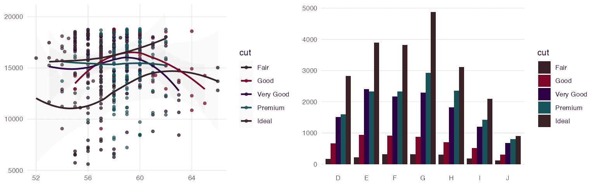
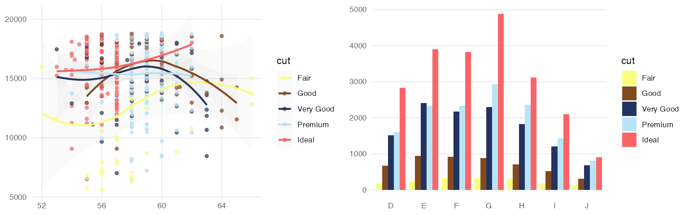

<!-- README.md is generated from README.Rmd. Please edit that file -->

# ggsci <a href="https://nanx.me/ggsci/"></a>

<!-- badges: start -->

[](https://github.com/nanxstats/ggsci/actions)
[](https://cran.r-project.org/package=ggsci)
[](https://cran.r-project.org/package=ggsci)
<!-- badges: end -->

`ggsci` offers a collection of `ggplot2` color palettes inspired by
scientific journals, data visualization libraries, science fiction
movies, and TV shows.

## Installation

You can install `ggsci` from CRAN:

``` r
install.packages("ggsci")
```

Or try the development version on GitHub:

``` r
remotes::install_github("nanxstats/ggsci")
```

[Browse the vignette](https://nanx.me/ggsci/articles/ggsci.html) (or
open with `vignette("ggsci")` in R) for a quick-start guide.

## Gallery

### NPG


### AAAS


### NEJM


### Lancet


### JAMA


### JCO


### UCSCGB


### D3


### LocusZoom


### IGV


### COSMIC



### UChicago


### Star Trek


### Tron Legacy


### Futurama


### Rick and Morty



### The Simpsons


### GSEA


### Material Design


## Contribute

To contribute to this project, please take a look at the [Contributing
Guidelines](CONTRIBUTING.md) first. Please note that this project is
released with a [Contributor Code of Conduct](CONDUCT.md). By
participating in this project you agree to abide by its terms.
