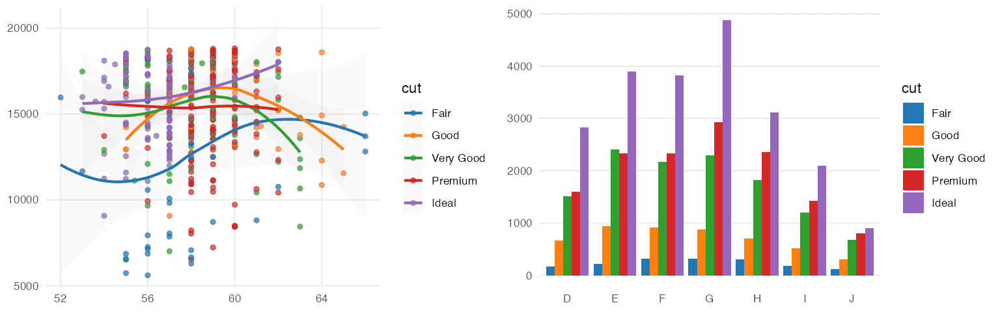
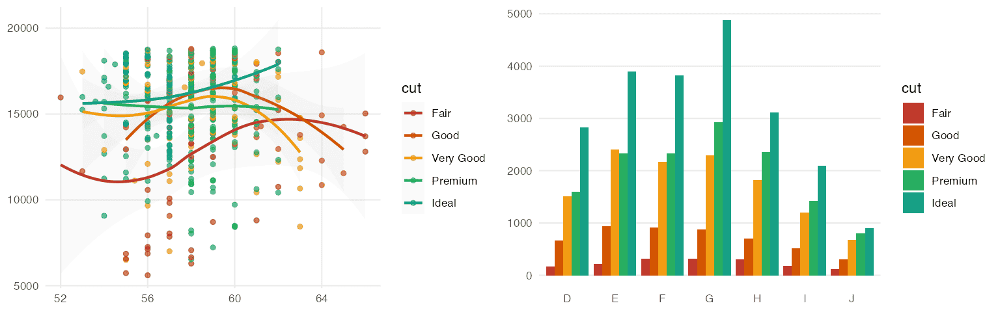

<!-- README.md is generated from README.Rmd. Please edit that file -->

# ggsci 

<!-- badges: start -->

[](https://github.com/nanxstats/ggsci/actions/workflows/R-CMD-check.yaml)
[](https://cran.r-project.org/package=ggsci)
[](https://cran.r-project.org/package=ggsci)
<!-- badges: end -->

`ggsci` offers a collection of `ggplot2` color palettes inspired by
scientific journals, data visualization libraries, science fiction
movies, and TV shows.

## Installation

You can install `ggsci` from CRAN:

``` r
install.packages("ggsci")
```

Or try the development version on GitHub:

``` r
remotes::install_github("nanxstats/ggsci")
```

[Browse the vignette](https://nanx.me/ggsci/articles/ggsci.html) (or
open with `vignette("ggsci")` in R) for a quick-start guide.

## Gallery

### NPG


### AAAS


### NEJM


### Lancet


### JAMA


### JCO


### UCSCGB


### D3



### LocusZoom


### IGV


### COSMIC


### UChicago


### Star Trek


### Tron Legacy


### Futurama


### Rick and Morty


### The Simpsons


### Flat UI



### Frontiers


### GSEA


### Material Design


## Contribute

To contribute to this project, please take a look at the [Contributing
Guidelines](https://nanx.me/ggsci/CONTRIBUTING.html) first. Please note
that the ggsci project is released with a [Contributor Code of
Conduct](https://nanx.me/ggsci/CODE_OF_CONDUCT.html). By contributing to
this project, you agree to abide by its terms.
