# Scientific Journal and Sci-Fi Themed Color Palettes for ggplot2

## Introduction

> My eyes were finally opened and I understood nature.
>
> I learned at the same time to love it.
>
> — Claude Monet

ggsci offers a collection of high-quality color palettes inspired by
colors used in scientific journals, data visualization libraries,
science fiction movies, and TV shows. The color palettes in ggsci are
available as ggplot2 scales. For all the color palettes, the
corresponding scales are named as:

- `scale_color_palname()`
- `scale_fill_palname()`

We also provided aliases, such as `scale_colour_palname()` for
`scale_color_palname()`. All available color palettes are summarized in
the table below.

[TABLE]

## Discrete color palettes

We will use scatterplots with smooth curves, and bar plots to
demonstrate the discrete color palettes in ggsci.

``` r
library("ggsci")
library("ggplot2")
library("gridExtra")
```

``` r
p1 <- example_scatterplot()
p2 <- example_barplot()
```

### NPG

The NPG palette is inspired by the plots in the journals published by
Nature Publishing Group:

``` r
p1_npg <- p1 + scale_color_npg()
p2_npg <- p2 + scale_fill_npg()
grid.arrange(p1_npg, p2_npg, ncol = 2)
```

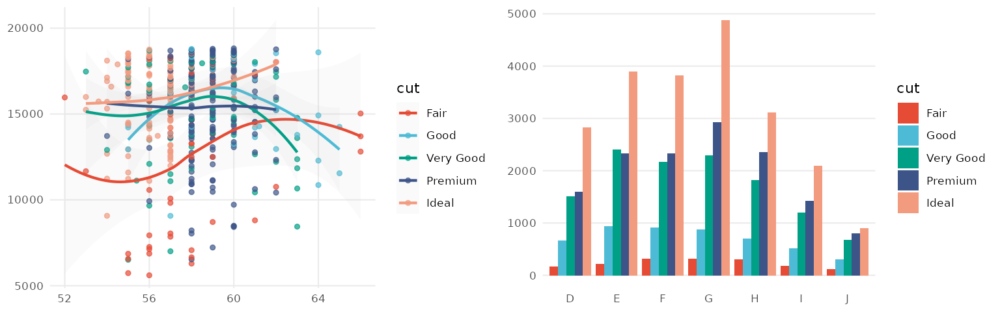

### AAAS

The AAAS palette is inspired by the plots in the journals published by
American Association for the Advancement of Science:

``` r
p1_aaas <- p1 + scale_color_aaas()
p2_aaas <- p2 + scale_fill_aaas()
grid.arrange(p1_aaas, p2_aaas, ncol = 2)
```

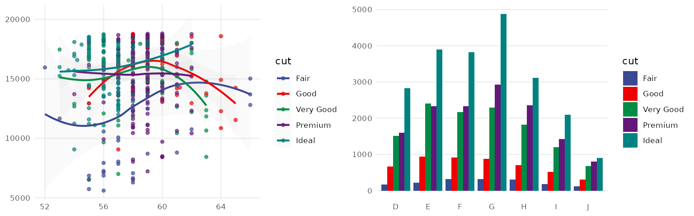

### NEJM

The NEJM palette is inspired by the plots in the *New England Journal of
Medicine*:

``` r
p1_nejm <- p1 + scale_color_nejm()
p2_nejm <- p2 + scale_fill_nejm()
grid.arrange(p1_nejm, p2_nejm, ncol = 2)
```


### Lancet

The Lancet palette is inspired by the plots in *Lancet* journals, such
as *Lancet Oncology*:

``` r
p1_lancet <- p1 + scale_color_lancet()
p2_lancet <- p2 + scale_fill_lancet()
grid.arrange(p1_lancet, p2_lancet, ncol = 2)
```

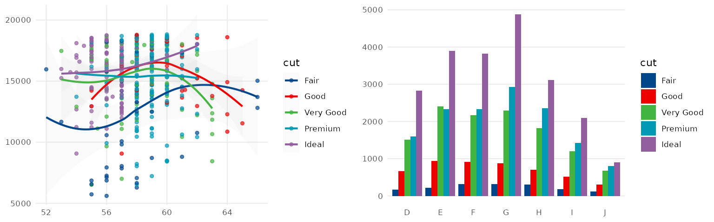

### JAMA

The JAMA palette is inspired by the plots in the *Journal of the
American Medical Association*:

``` r
p1_jama <- p1 + scale_color_jama()
p2_jama <- p2 + scale_fill_jama()
grid.arrange(p1_jama, p2_jama, ncol = 2)
```


### BMJ

The BMJ palette is from the [BMJ living style
guide](https://technology.bmj.com/living-style-guide/colour.html):

``` r
p1_bmj <- p1 + scale_color_bmj()
p2_bmj <- p2 + scale_fill_bmj()
grid.arrange(p1_bmj, p2_bmj, ncol = 2)
```


### JCO

The JCO palette is inspired by the the plots in *Journal of Clinical
Oncology*:

``` r
p1_jco <- p1 + scale_color_jco()
p2_jco <- p2 + scale_fill_jco()
grid.arrange(p1_jco, p2_jco, ncol = 2)
```


### UCSCGB

The UCSCGB palette is from the colors used by [UCSC Genome
Browser](https://genome.ucsc.edu) for representing chromosomes. This
palette (interpolated, with alpha) is intensively used in visualizations
generated by Circos.

``` r
p1_ucscgb <- p1 + scale_color_ucscgb()
p2_ucscgb <- p2 + scale_fill_ucscgb()
grid.arrange(p1_ucscgb, p2_ucscgb, ncol = 2)
```

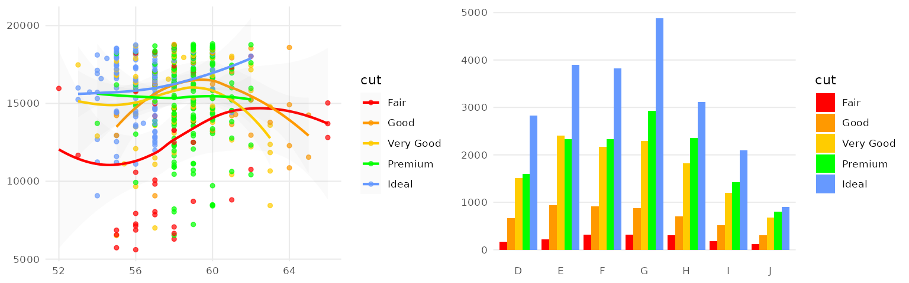

### D3

The D3 palette is from the categorical colors used by
[D3.js](https://d3js.org) (version 3.x and before). There are four
palette types (`category10`, `category20`, `category20b`, `category20c`)
available.

``` r
p1_d3 <- p1 + scale_color_d3()
p2_d3 <- p2 + scale_fill_d3()
grid.arrange(p1_d3, p2_d3, ncol = 2)
```

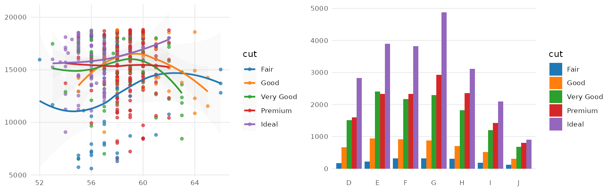

### Observable

The [Observable 10
palette](https://observablehq.com/blog/crafting-data-colors) is the
default categorical colors scheme used by Observable.

``` r
p1_observable <- p1 + scale_color_observable()
p2_observable <- p2 + scale_fill_observable()
grid.arrange(p1_observable, p2_observable, ncol = 2)
```


### Primer

The Primer palette follows the data visualization colors from [GitHub’s
Primer design
system](https://primer.style/product/ui-patterns/data-visualization/).

``` r
p1_primer <- p1 + scale_color_primer()
p2_primer <- p2 + scale_fill_primer()
grid.arrange(p1_primer, p2_primer, ncol = 2)
```

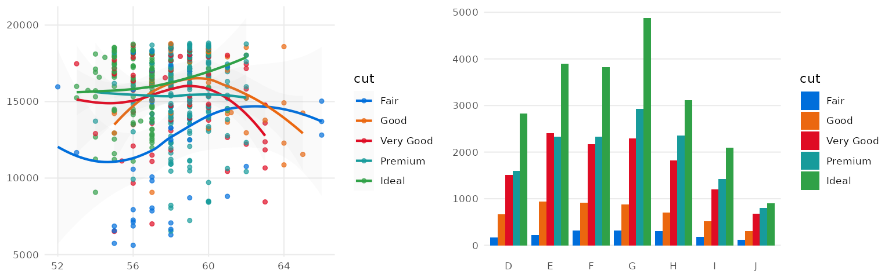

### Atlassian

The palette follows the categorical chart colors from [Atlassian Design
System](https://atlassian.design/foundations/color-new/data-visualization-color).

``` r
p1_atlassian <- p1 + scale_color_atlassian()
p2_atlassian <- p2 + scale_fill_atlassian()
grid.arrange(p1_atlassian, p2_atlassian, ncol = 2)
```

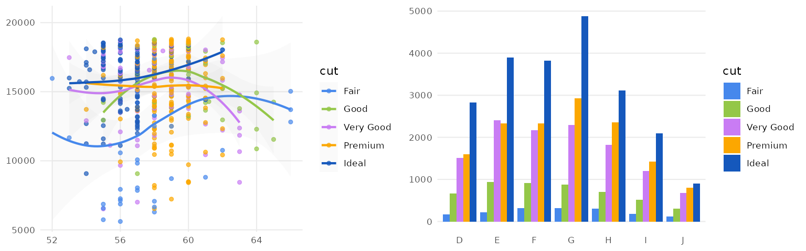

### iTerm

These palettes are sourced from the iterm2-color-schemes project, which
includes 400+ color schemes (list them with
[`iterm_palettes()`](https://nanx.me/ggsci/reference/iterm_palettes.md)).
Each scheme provides six categorical colors with two possible variants:
`"normal"` and `"bright"`.

You can preview these color palettes in ggsci on a dedicated microsite:
<https://nanx.me/ggsci-iterm/>. It renders example plots for all
palettes on a single page for fast visual comparison.

``` r
p1_iterm <- p1 + scale_color_iterm("Rose Pine")
p2_iterm <- p2 + scale_fill_iterm("Rose Pine")
grid.arrange(p1_iterm, p2_iterm, ncol = 2)
```


### LocusZoom

The LocusZoom palette is based on the colors used by
[LocusZoom](http://locuszoom.org/).

``` r
p1_locuszoom <- p1 + scale_color_locuszoom()
p2_locuszoom <- p2 + scale_fill_locuszoom()
grid.arrange(p1_locuszoom, p2_locuszoom, ncol = 2)
```


### IGV

The IGV palette is from the colors used by [Integrative Genomics
Viewer](https://igv.org/doc/desktop/) for representing chromosomes.
There are two palette types (`default`, `alternating`) available.

``` r
p1_igv_default <- p1 + scale_color_igv()
p2_igv_default <- p2 + scale_fill_igv()
grid.arrange(p1_igv_default, p2_igv_default, ncol = 2)
```

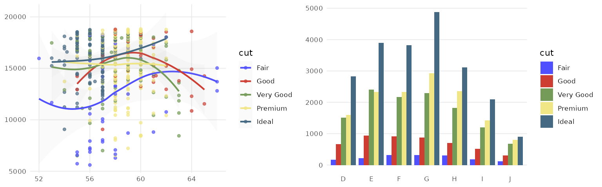

### COSMIC

Color palettes inspired by the colors used in projects from the
[Catalogue Of Somatic Mutations in Cancers
(COSMIC)](https://cancer.sanger.ac.uk/cosmic).

``` r
p1_cosmic_hallmarks_light <- p1 + scale_color_cosmic("hallmarks_light")
p2_cosmic_hallmarks_light <- p2 + scale_fill_cosmic("hallmarks_light")
grid.arrange(p1_cosmic_hallmarks_light, p2_cosmic_hallmarks_light, ncol = 2)
```


``` r
p1_cosmic_hallmarks_dark <- p1 + scale_color_cosmic("hallmarks_dark")
p2_cosmic_hallmarks_dark <- p2 + scale_fill_cosmic("hallmarks_dark")
grid.arrange(p1_cosmic_hallmarks_dark, p2_cosmic_hallmarks_dark, ncol = 2)
```


``` r
p1_cosmic_signature <- p1 + scale_color_cosmic("signature_substitutions")
p2_cosmic_signature <- p2 + scale_fill_cosmic("signature_substitutions")
grid.arrange(p1_cosmic_signature, p2_cosmic_signature, ncol = 2)
```

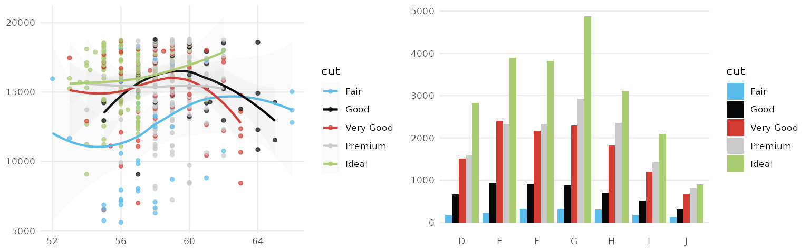

### UChicago

The UChicago palette is based on [the
colors](https://news.uchicago.edu/sites/default/files/attachments/_uchicago.identity.guidelines.pdf)
used by the University of Chicago. There are three palette types
(`default`, `light`, `dark`) available.

``` r
p1_uchicago <- p1 + scale_color_uchicago()
p2_uchicago <- p2 + scale_fill_uchicago()
grid.arrange(p1_uchicago, p2_uchicago, ncol = 2)
```


### Star Trek

This palette is inspired by the (uniform) colors in *Star Trek*:

``` r
p1_startrek <- p1 + scale_color_startrek()
p2_startrek <- p2 + scale_fill_startrek()
grid.arrange(p1_startrek, p2_startrek, ncol = 2)
```

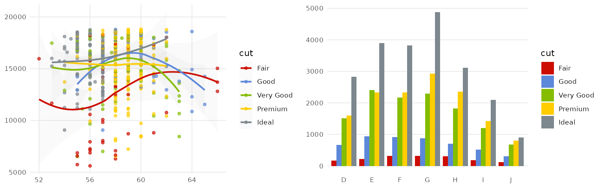

### Tron Legacy

This palette is inspired by the colors used in *Tron Legacy*. It is
suitable for displaying data when using a dark theme:

``` r
p1_tron <- p1 + theme_dark() + theme(
  panel.background = element_rect(fill = "#2D2D2D"),
  legend.key = element_rect(fill = "#2D2D2D")
) +
  scale_color_tron()
p2_tron <- p2 + theme_dark() + theme(
  panel.background = element_rect(fill = "#2D2D2D")
) +
  scale_fill_tron()
grid.arrange(p1_tron, p2_tron, ncol = 2)
```

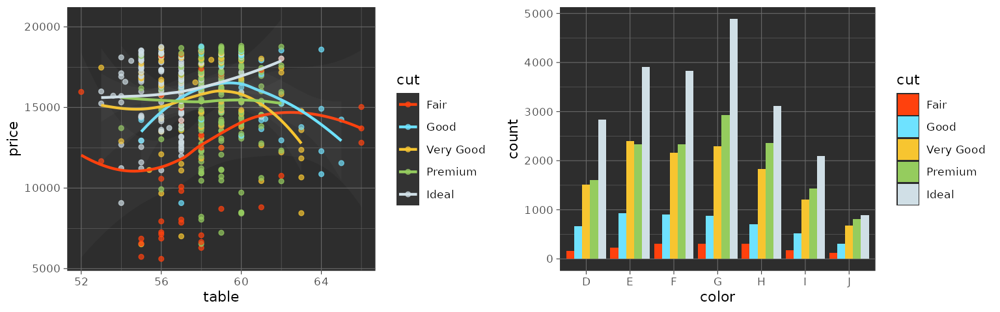

### Futurama

This palette is inspired by the colors used in the TV show *Futurama*:

``` r
p1_futurama <- p1 + scale_color_futurama()
p2_futurama <- p2 + scale_fill_futurama()
grid.arrange(p1_futurama, p2_futurama, ncol = 2)
```


### Rick and Morty

This palette is inspired by the colors used in the TV show *Rick and
Morty*:

``` r
p1_rickandmorty <- p1 + scale_color_rickandmorty()
p2_rickandmorty <- p2 + scale_fill_rickandmorty()
grid.arrange(p1_rickandmorty, p2_rickandmorty, ncol = 2)
```

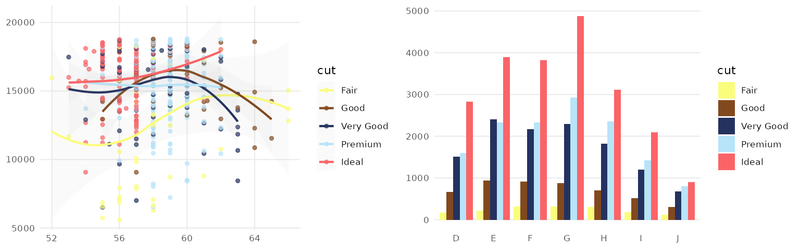

### The Simpsons

This palette is inspired by the colors used in the TV show *The
Simpsons*:

``` r
p1_simpsons <- p1 + scale_color_simpsons()
p2_simpsons <- p2 + scale_fill_simpsons()
grid.arrange(p1_simpsons, p2_simpsons, ncol = 2)
```


### Flat UI

Three flat UI color palettes from [Flat UI Colors
2](https://flatuicolors.com):

``` r
p1_flatui <- p1 + scale_color_flatui()
p2_flatui <- p2 + scale_fill_flatui()
grid.arrange(p1_flatui, p2_flatui, ncol = 2)
```


### Frontiers

This color palette inspired by [Frontiers](https://www.frontiersin.org):

``` r
p1_frontiers <- p1 + scale_color_frontiers()
p2_frontiers <- p2 + scale_fill_frontiers()
grid.arrange(p1_frontiers, p2_frontiers, ncol = 2)
```


## Continuous color palettes

There are two types of continuous color palettes in ggsci: diverging and
sequential. Diverging palettes have a central neutral color and
contrasting colors at the ends, making them suitable for visualizing
data with a natural midpoint. Sequential palettes use a gradient of
colors that range from low to high intensity or lightness, making them
ideal for representing data with increasing or decreasing values.

We will use a correlation matrix visualization (a special type of
heatmap) to demonstrate the diverging color palettes.

``` r
data("mtcars")
cor <- cor(unname(mtcars))
cor_melt <- data.frame(
  Var1 = rep(seq_len(nrow(cor)), times = ncol(cor)),
  Var2 = rep(seq_len(ncol(cor)), each = nrow(cor)),
  value = as.vector(cor)
)

p3 <- ggplot(cor_melt, aes(x = Var1, y = Var2, fill = value)) +
  geom_tile(colour = "black", linewidth = 0.3) +
  theme_void() +
  theme(
    axis.title.x = element_blank(),
    axis.title.y = element_blank()
  )
```

To demonstrate sequential palettes, we use a random matrix:

``` r
set.seed(42)
k <- 6
x <- diag(k)
x[upper.tri(x)] <- runif(sum(1:(k - 1)), 0, 1)
x_melt <- data.frame(
  Var1 = rep(seq_len(nrow(x)), times = ncol(x)),
  Var2 = rep(seq_len(ncol(x)), each = nrow(x)),
  value = as.vector(x)
)

p4 <- ggplot(x_melt, aes(x = Var1, y = Var2, fill = value)) +
  geom_tile(colour = "black", linewidth = 0.3) +
  scale_x_continuous(expand = c(0, 0)) +
  scale_y_continuous(expand = c(0, 0)) +
  theme_bw() +
  theme(
    legend.position = "none", plot.background = element_blank(),
    axis.line = element_blank(), axis.ticks = element_blank(),
    axis.text.x = element_blank(), axis.text.y = element_blank(),
    axis.title.x = element_blank(), axis.title.y = element_blank(),
    panel.background = element_blank(), panel.border = element_blank(),
    panel.grid.major = element_blank(), panel.grid.minor = element_blank()
  )
```

### GSEA

The GSEA palette (continuous) is inspired by the heatmaps generated by
[GSEA
GenePattern](https://software.broadinstitute.org/cancer/software/genepattern/).

``` r
p3_gsea <- p3 + scale_fill_gsea()
p3_gsea_inv <- p3 + scale_fill_gsea(reverse = TRUE)
grid.arrange(p3_gsea, p3_gsea_inv, ncol = 2)
```

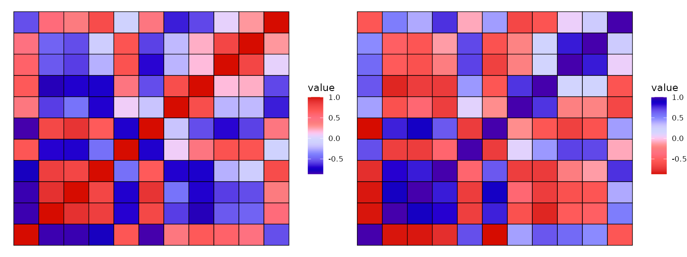

### Bootstrap 5

The Bootstrap 5 color palettes are from the [Bootstrap 5 color
system](https://getbootstrap.com/docs/5.3/customize/color/#all-colors).

``` r
grid.arrange(
  p4 + scale_fill_bs5("blue"), p4 + scale_fill_bs5("indigo"),
  p4 + scale_fill_bs5("purple"), p4 + scale_fill_bs5("pink"),
  p4 + scale_fill_bs5("red"), p4 + scale_fill_bs5("orange"),
  p4 + scale_fill_bs5("yellow"), p4 + scale_fill_bs5("green"),
  p4 + scale_fill_bs5("teal"), p4 + scale_fill_bs5("cyan"),
  p4 + scale_fill_bs5("gray"),
  ncol = 8
)
```


### Material Design

The Material Design color palettes are from the [Material Design color
system](https://m2.material.io/design/color/the-color-system.html).

``` r
grid.arrange(
  p4 + scale_fill_material("red"), p4 + scale_fill_material("pink"),
  p4 + scale_fill_material("purple"), p4 + scale_fill_material("deep-purple"),
  p4 + scale_fill_material("indigo"), p4 + scale_fill_material("blue"),
  p4 + scale_fill_material("light-blue"), p4 + scale_fill_material("cyan"),
  p4 + scale_fill_material("teal"), p4 + scale_fill_material("green"),
  p4 + scale_fill_material("light-green"), p4 + scale_fill_material("lime"),
  p4 + scale_fill_material("yellow"), p4 + scale_fill_material("amber"),
  p4 + scale_fill_material("orange"), p4 + scale_fill_material("deep-orange"),
  p4 + scale_fill_material("brown"), p4 + scale_fill_material("grey"),
  p4 + scale_fill_material("blue-grey"),
  ncol = 8
)
```


### Tailwind CSS

The Tailwind CSS color palettes are from the [Tailwind default
colors](https://tailwindcss.com/docs/customizing-colors).

``` r
grid.arrange(
  p4 + scale_fill_tw3("slate"), p4 + scale_fill_tw3("gray"),
  p4 + scale_fill_tw3("zinc"), p4 + scale_fill_tw3("neutral"),
  p4 + scale_fill_tw3("stone"), p4 + scale_fill_tw3("red"),
  p4 + scale_fill_tw3("orange"), p4 + scale_fill_tw3("amber"),
  p4 + scale_fill_tw3("yellow"), p4 + scale_fill_tw3("lime"),
  p4 + scale_fill_tw3("green"), p4 + scale_fill_tw3("emerald"),
  p4 + scale_fill_tw3("teal"), p4 + scale_fill_tw3("cyan"),
  p4 + scale_fill_tw3("sky"), p4 + scale_fill_tw3("blue"),
  p4 + scale_fill_tw3("indigo"), p4 + scale_fill_tw3("violet"),
  p4 + scale_fill_tw3("purple"), p4 + scale_fill_tw3("fuchsia"),
  p4 + scale_fill_tw3("pink"), p4 + scale_fill_tw3("rose"),
  ncol = 8
)
```


From the figure above, we can see that even though an identical matrix
was visualized by all plots, some palettes are more preferable than the
others because our eyes are more sensitive to the changes of their
saturation levels.

## Non-ggplot2 graphics

To apply the color palettes in ggsci to other graphics systems (such as
base graphics and lattice graphics), simply use the palette generator
functions in the table above. For example:

``` r
mypal <- pal_npg("nrc", alpha = 0.7)(9)
mypal
#> [1] "#E64B35B2" "#4DBBD5B2" "#00A087B2" "#3C5488B2" "#F39B7FB2" "#8491B4B2"
#> [7] "#91D1C2B2" "#DC0000B2" "#7E6148B2"

scales::show_col(mypal)
```


You will be able to use the generated hex color codes for such graphics
systems accordingly. The transparent level of the entire palette is
easily adjustable via the argument `"alpha"` in every generator or scale
function.

## Discussion

Please note some of the palettes might not be the best choice for
certain purposes, such as color-blind safe, photocopy safe, or print
friendly. If you do have such considerations, you might want to check
out color palettes like [ColorBrewer](https://colorbrewer2.org) and
[viridis](https://cran.r-project.org/package=viridis).

The color palettes in this package are solely created for research
purposes. The authors are not responsible for the usage of such
palettes.
