# ggsci

ggsci offers a collection of ggplot2 color palettes inspired by
scientific journals, data visualization libraries, science fiction
movies, and TV shows.

## Installation

You can install ggsci from CRAN:

``` r
install.packages("ggsci")
```

Or try the development version on GitHub:

``` r
remotes::install_github("nanxstats/ggsci")
```

[Browse the vignette](https://nanx.me/ggsci/articles/ggsci.html) (or
open with [`vignette("ggsci")`](https://nanx.me/ggsci/articles/ggsci.md)
in R) for a quick-start guide.

## Gallery

### NPG


### AAAS

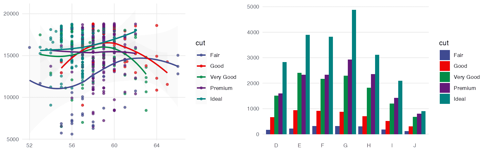

### NEJM


### Lancet

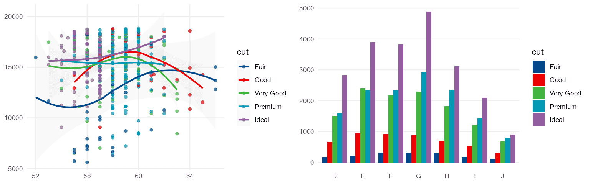

### JAMA


### BMJ

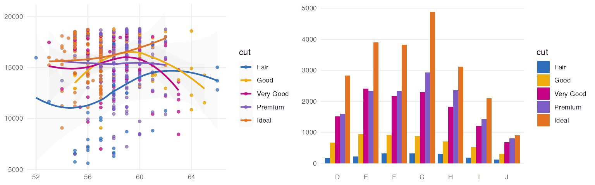

### JCO


### UCSCGB


### D3


### Observable

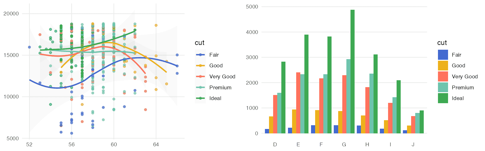

### Primer


### Atlassian

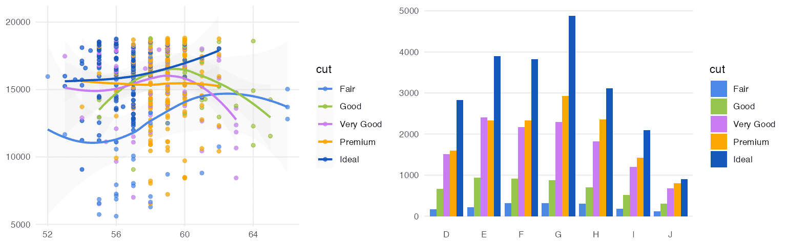

### iTerm


### LocusZoom


### IGV


### COSMIC

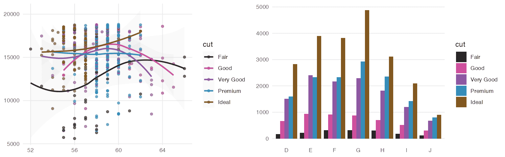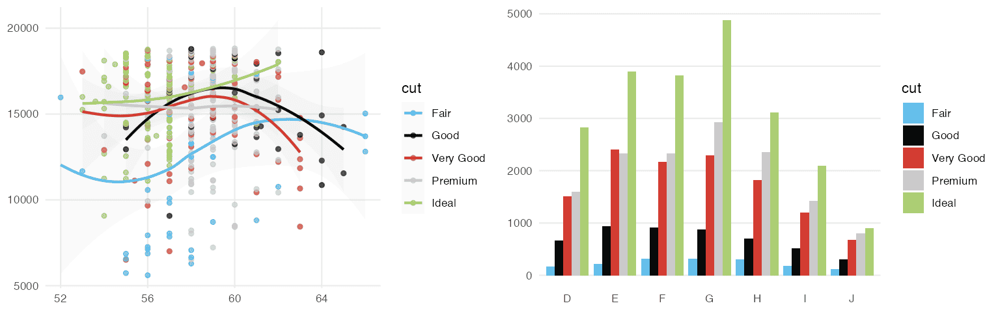

### UChicago


### Star Trek


### Tron Legacy

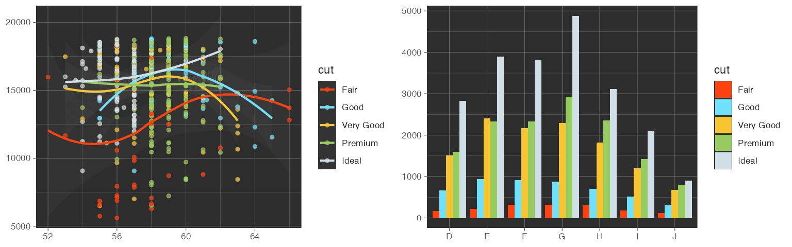

### Futurama


### Rick and Morty


### The Simpsons

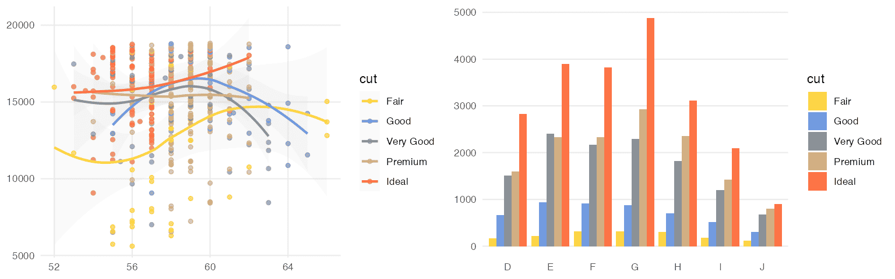

### Flat UI


### Frontiers

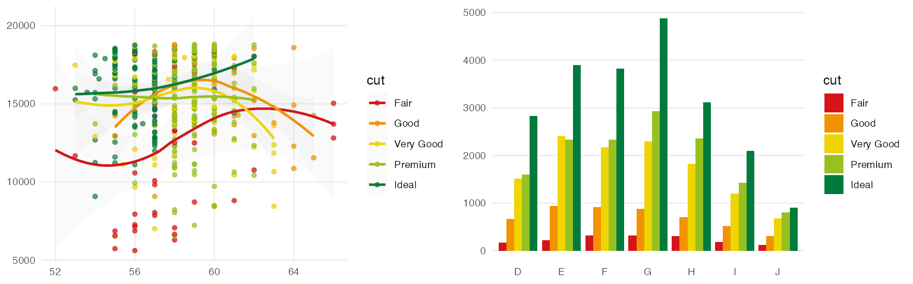

### GSEA

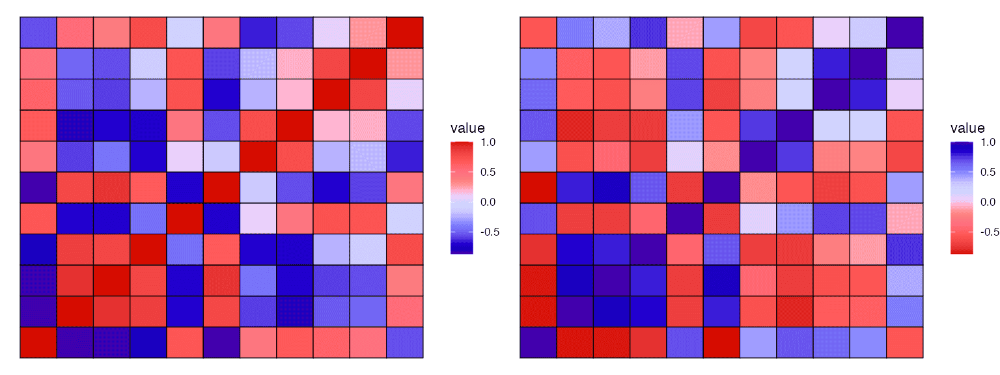

### Bootstrap 5


### Material Design


### Tailwind CSS


## Contribute

To contribute to this project, please take a look at the [Contributing
Guidelines](https://nanx.me/ggsci/CONTRIBUTING.html) first. Please note
that the ggsci project is released with a [Contributor Code of
Conduct](https://nanx.me/ggsci/CODE_OF_CONDUCT.html). By contributing to
this project, you agree to abide by its terms.
